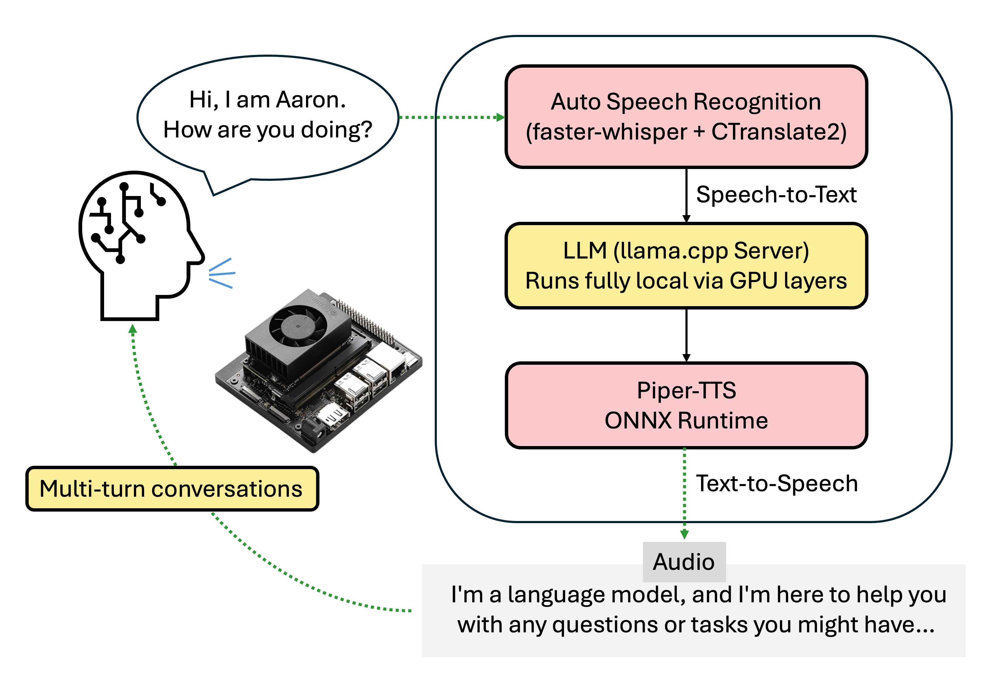

# Jetson Conversational AI (Real-Time Speech → LLM → TTS)
A fully local, real-time ChatBot running on the  **Jetson Orin Nano**, integrating **Whisper ASR (faster-whisper + CTranslate2)**, **llama.cpp LLM**, and **Piper TTS** — all GPU-accelerated and optimized for edge deployment.

This project captures live microphone audio, converts it to text, generates responses using a local LLM server, synthesizes speech, and outputs audio through Jetson speakers — all offline and low-latency.



## Features

### Real-Time Voice Interaction  
- Live microphone recording (ALSA / ffmpeg)  
- Whisper ASR (Faster-Whisper + CTranslate2 GPU)  
- llama-server (llama.cpp GPU) for LLM responses  
- Piper TTS ONNX speech synthesis  
- ALSA speaker output (aplay)

### On-Device GPU Acceleration  
- Whisper ASR fully accelerated with CTranslate2 (CUDA)  
- Local LLM accelerated by llama.cpp CUDA kernels  
- No need for cloud APIs (OpenAI, Google, etc.)

### Multi-turn Conversations
Maintains message history to enable context-aware responses.

## Environment Setup

### Build Image

```bash
docker build -t jetson-voice-ai .
```

### Run Container (Microphone + Speaker + Network)

```bash
docker run -it --rm \
  -v /dev/snd:/dev/snd \
  -p 8080:8080 \
  --device /dev/snd \
  --device /dev/bus/usb \
  --privileged \
  jetson-voice-ai
```

## How to Use

### Start Real-Time Voice Dialogue

```bash
python3 src/main.py
```

Pipeline:
1. Start microphone recording  
2. Whisper GPU ASR → text  
3. llama-server → responds  
4. Piper TTS → speech  
5. aplay → audio  

## Test Individual Components

### Test llama-server

Start server:
```bash
/app/llama.cpp/build/bin/llama-server \
  -m /app/models/gguf/nemotron-8b-q4km.gguf \
  --port 8080 \
  --gpu-layers 999 \
  --ctx-size 4096
```

Send prompt:
```bash
curl http://localhost:8080/completions -H "Content-Type: application/json" \
  -d '{"prompt":"Hello!", "n_predict":100}'
```

### Test Whisper ASR

Record 5 seconds:
```bash
arecord -D plughw:2,0 -f cd test.wav -d 5
```

Transcribe:
```bash
python3 - <<EOF
from whisper.asr import WhisperASR
asr = WhisperASR("small")
print(asr.transcribe("test.wav"))
EOF
```

### Test Piper TTS

Generate:
```bash
echo "hello world" | piper   --model /app/models/piper/voice.onnx   --output_file test.wav
```

Play:
```bash
aplay test.wav
```